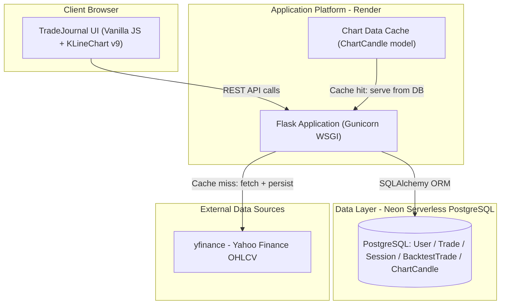
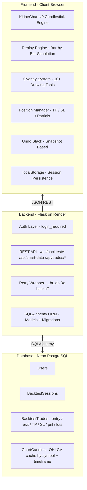
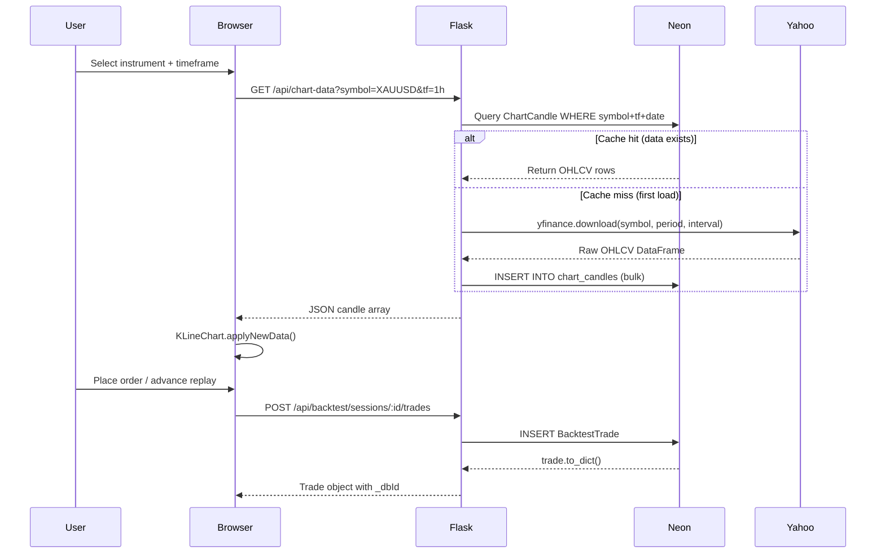
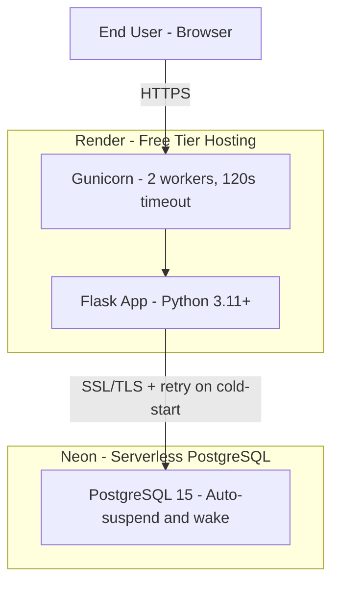

# TradeJournal Platform

<div align="center">

**Institutional-grade trade journaling and strategy backtesting — engineered for the serious retail trader.**

[](https://python.org)
[](https://flask.palletsprojects.com)
[](https://neon.tech)
[](https://render.com)
[](https://anthropic.com)
[]()

</div>

---

> **This entire platform was built using Vibe Coding** — a modern AI-accelerated development methodology where a human with domain expertise and strategic vision directs an AI collaborator (Claude, Anthropic) to architect, write, debug, and iterate on production-grade software in real time. No traditional development team. No sprint cycles. No agency retainer. Just sharp product thinking, a clear problem statement, and an AI pair-programmer that writes code as fast as decisions get made.

---

## Executive Summary

Most retail traders lose capital not because markets are inaccessible, but because they lack the infrastructure to learn from their decisions. They journal in spreadsheets, backtest in their heads, and have no systematic feedback loop between strategy and outcome.

TradeJournal closes that gap. It is a full-stack web platform that gives individual traders a structured environment to record every trade, replay historical market conditions bar-by-bar, and extract pattern-level insight from their own performance data. Think of it as a Bloomberg Terminal for strategy development — without the six-figure price tag.

The platform is live, production-deployed, and actively used. It is architected to scale from a single user to a multi-tenant SaaS product without fundamental redesign.

---

## The Problem This Solves

> *"The difference between a profitable trader and an unprofitable one is rarely intelligence. It is process."*

Retail traders managing their own capital face three structural disadvantages:

**No institutional feedback loop.** Professional trading desks run daily P&L reviews, drawdown attribution, and strategy post-mortems. Retail traders have a broker statement and a gut feeling.

**No controlled testing environment.** Testing a strategy in live markets is expensive and emotionally distorted. Most traders have no way to simulate "what would happen if I took this setup, at this time, on this instrument" without risking real capital.

**No data-driven accountability.** Without structured journaling, traders repeat the same mistakes because they cannot see patterns in their own behavior across hundreds of trades.

TradeJournal solves all three with a single integrated platform.

---

## Platform Capabilities

| Capability | What It Does | Business Value |
|---|---|---|
| **Chart Replay Engine** | Bar-by-bar replay of real OHLCV data across 5 instruments and 5 timeframes | Simulates live trading without capital risk |
| **Session-Based Backtesting** | Full trade lifecycle simulation: entry, SL, TP, partial close, auto-hit | Validates strategy before live deployment |
| **Trade Journal** | Structured capture of every trade with metadata, tags, and P&L attribution | Creates the data asset that drives improvement |
| **Drawing Tools** | 10+ chart annotation tools with per-tool color, undo stack, and persistence | Enables markup of setups and thesis documentation |
| **Position Management** | Draggable TP/SL lines, partial close at any lot size, real-time P&L overlay | Mirrors the execution workflow of professional desks |
| **Session Persistence** | Replay position survives reload, tab-close, and timeframe switching | Eliminates workflow interruption in extended study sessions |
| **Undo System** | Full Ctrl+Z support across replay steps, order placement, close, and drawings | Supports iterative, exploratory strategy testing |
| **Analytics Dashboard** | Win rate, profit factor, average win/loss, max drawdown, equity curve | Converts raw trade data into actionable performance metrics |
| **Psychology Layer** | LLM-powered emotion extraction, discipline scoring, phrase-level attribution | Quantifies the behavioral edge that numbers alone cannot capture |

---

## Instruments Covered

| Symbol | Asset Class | Contract Size |
|---|---|---|
| XAUUSD | Precious Metals — Gold | 100 oz |
| USOIL | Commodities — Crude Oil | 1,000 barrels |
| BTCUSD | Cryptocurrency — Bitcoin | 1 BTC |
| ETHUSD | Cryptocurrency — Ethereum | 1 ETH |
| EURUSD | Forex — Euro/Dollar | 100,000 units |

---

## Architecture

### System Context



The system follows a clean three-tier architecture. The client never touches the database directly. All market data is fetched once from Yahoo Finance, persisted in PostgreSQL, and served from cache on every subsequent request — eliminating API rate limits and latency spikes as the user base scales.

---

### Application Architecture



**Key design decisions explained:**

**Vanilla JS over React/Vue.** The chart interaction layer is dominated by KLineChart's own event model. Introducing a reactive framework would add build tooling, a virtual DOM reconciliation layer, and potential conflicts with KLineChart's canvas rendering lifecycle. The current architecture keeps the JS footprint minimal and the deployment pipeline zero-configuration.

**Snapshot-based undo over command pattern.** The undo system stores deep copies of order state and visible chart position at every action boundary. This is more memory-intensive than a pure command pattern, but dramatically simpler to reason about when undo must cross asynchronous boundaries — for example, undoing a trade that triggered an SL auto-close mid-play session.

**Chart data cached in PostgreSQL over in-memory.** Storing OHLCV data in the database means the Render dyno can cold-start without re-fetching market data from Yahoo Finance on every request. The cache survives deployments and can be pre-populated for new instruments without user-facing latency.

---

### Data Flow



---

### Infrastructure Topology



**Why Render over AWS/GCP.** For a single-user or early-stage product, Render eliminates DevOps overhead entirely: zero server provisioning, automatic HTTPS, GitHub-integrated deploys, and a free tier that covers proof-of-concept workloads. The tradeoff is cold-start latency after periods of inactivity — mitigated in the application layer by the `_bt_db()` retry wrapper with exponential backoff.

**Why Neon over managed RDS.** Neon's serverless PostgreSQL offers branching (instant database clones for testing), auto-suspend (zero cost during inactivity), and a connection pooler that handles the burst reconnect patterns of a Render free-tier dyno. RDS would provide more consistent latency but at 10x the monthly cost for this usage profile.

---

## Technology Stack — Decision Rationale

| Layer | Technology | Why This, Not That |
|---|---|---|
| **Web Framework** | Flask 3.x | Lightweight, no ORM coupling, clean routing. FastAPI considered but overkill without async data pipelines. |
| **ORM** | SQLAlchemy 2.x | Industry-standard Python ORM. Django ORM rejected — full Django framework is excess for this scope. |
| **Database** | PostgreSQL via Neon | ACID compliance, rich query capabilities, serverless cost model. SQLite rejected for multi-user readiness. |
| **Chart Engine** | KLineChart v9 | Purpose-built financial charting with native overlay, indicator, and custom drawing APIs. Lightweight vs TradingView. |
| **Hosting** | Render | Zero-ops deployment, GitHub CI/CD, automatic HTTPS. Heroku equivalent at lower cost. |
| **Market Data** | yfinance | Free, no API key, covers all target instruments. Polygon.io considered for production upgrade path. |
| **Auth** | Flask-Login | Session-based auth, battle-tested, minimal configuration. JWT considered but stateless auth adds complexity without benefit at this scale. |
| **AI Layer** | Claude (Anthropic) | Psychology scoring, emotion extraction, discipline attribution. GPT-4 evaluated; Claude chosen for reasoning depth on qualitative trade notes. |

---

## How It Was Built — Vibe Coding

This platform is a proof point for what modern AI-accelerated development can deliver.

**Vibe Coding** is not prompt engineering. It is a development methodology where a human with deep domain knowledge — in this case, a trader who understands P&L attribution, risk management, and execution psychology — acts as the product director, and an AI system (Claude by Anthropic) acts as the senior engineer. The human sets constraints, evaluates tradeoffs, and makes product decisions. The AI writes production code, debugs errors from server logs, navigates library APIs, and proposes architectural patterns.

The result: a full-stack, database-backed, production-deployed trading platform — with a backtesting engine, drawing tools, undo system, real-time position management, and analytics — built in a fraction of the time and cost of a traditional development engagement.

**What this demonstrates for enterprise leaders:**

For CFOs: The cost-to-capability ratio of Vibe Coding fundamentally disrupts the economics of custom software. A feature that would cost $40,000 in a traditional sprint can be delivered in hours when the domain expert is in the loop with an AI collaborator.

For CTOs: Vibe Coding does not eliminate engineering judgment. It amplifies it. Architectural decisions — database choice, caching strategy, undo pattern, API design — still require a human who understands tradeoffs. The AI executes those decisions at speed.

For CEOs and VPs of Product: The velocity unlocked by this methodology compresses the feedback loop between idea and working software from weeks to hours. That is a strategic advantage in any competitive market.

---

## Deployment Architecture

```
GitHub (main branch)
       │
       │  git push → auto-deploy
       ▼
Render Build Pipeline
  pip install -r requirements.txt
  flask db upgrade (Alembic migrations)
  gunicorn app:app --workers 2 --timeout 120
       │
       ▼
Live at: https://[your-app].onrender.com
```

Environment variables managed via Render dashboard (never committed to source):

| Variable | Purpose |
|---|---|
| `DATABASE_URL` | Neon PostgreSQL connection string (SSL) |
| `SECRET_KEY` | Flask session signing key |
| `FLASK_ENV` | `production` — disables debug mode |
| `ANTHROPIC_API_KEY` | Claude API for psychology layer |

---

## Strategic Roadmap

Each phase is a shippable product increment, not a rewrite.

### Phase I — Complete
Core journaling, chart replay engine, session-based backtesting, drawing tools, position management, undo system, and session persistence.

### Phase II — In Progress
Per-session analytics with equity curve, trade distribution heatmap, drawdown chart, and setup-level win rate breakdown.

### Phase III — Planned
Multi-user support with shared session review (mentorship model), strategy tagging and filtering, and automated pattern recognition on historical trade entries.

### Phase IV — Exploration
Integration with live broker APIs (OANDA, Interactive Brokers) to import real trade history automatically. Polygon.io upgrade for tick-level data. Mobile-responsive layout.

---

## Performance Characteristics

| Metric | Current Baseline | Target (Phase III) |
|---|---|---|
| Chart data load (cached) | < 400ms | < 200ms |
| Chart data load (cold, cache miss) | 3–8s (yfinance fetch) | < 2s (pre-populated) |
| API cold start (Neon wake) | 1–3s (retried automatically) | < 500ms (connection pool) |
| Replay step latency | < 16ms (60fps capable) | < 16ms |
| Concurrent users supported | 1–5 (free tier) | 50–200 (paid tier upgrade) |

---

## Risk Register

| Risk | Likelihood | Impact | Mitigation |
|---|---|---|---|
| Neon cold-start SSL drop | Medium | Low | `_bt_db()` retry wrapper with exponential backoff, deployed |
| Render dyno sleep (free tier) | High | Low | 30–45s wake time acceptable for personal use; upgrade path clear |
| yfinance API deprecation | Low | High | Data cached in PostgreSQL; only affects new symbol loads |
| KLineChart v9 breaking change | Low | Medium | Pinned to v9.8.12 via CDN; upgrade path documented |
| Single-user data isolation | N/A | High | `user_id` foreign key on all models; all routes enforce `login_required` |

---

## Project Structure

```
tradejournal/
├── app.py                  # Application factory, all routes, business logic
├── models.py               # SQLAlchemy models (User, Trade, BacktestSession ...)
├── config.py               # Environment config, instrument constants
├── metrics.py              # KPI calculations (profit factor, Sharpe, drawdown)
├── sentiment.py            # AI-powered sentiment and psychology utilities
├── requirements.txt        # Pinned Python dependencies
├── templates/
│   ├── base.html           # Layout shell, nav, auth state
│   ├── backtest.html       # Chart replay + backtesting platform (primary feature)
│   ├── journal.html        # Trade journal entry and review
│   ├── dashboard.html      # Analytics and P&L overview
│   └── ...
└── static/
    ├── css/                # Global styles
    └── js/                 # Shared client-side utilities
```

---

## Competitive Positioning

| Platform | Backtesting | Journaling | Price | Customizable |
|---|---|---|---|---|
| **TradeJournal** | Bar-by-bar replay | Full, structured | Open source / Self-hosted | Full — your code |
| TradingView | Limited (paid tier only) | None native | $15–60/month | No |
| Edgewonk | No | Yes | $169 one-time | No |
| TraderVue | No | Yes | $29–49/month | No |
| Tradezella | Limited | Yes | $35/month | No |

TradeJournal is the only solution in this space that combines real bar-by-bar replay backtesting with structured journaling and an AI psychology layer in a single, self-hostable platform at zero ongoing cost.

---

## Quick Start

```bash
# Clone and set up environment
git clone https://github.com/your-username/tradejournal.git
cd tradejournal
python -m venv venv && source venv/bin/activate
pip install -r requirements.txt

# Configure environment
cp .env.example .env
# Edit .env — set DATABASE_URL, SECRET_KEY, ANTHROPIC_API_KEY

# Initialize database
flask db upgrade

# Run locally
flask run
# Open http://localhost:5000
```

---

<div align="center">

*Built with discipline. Engineered for edge. Powered by Vibe Coding.*

</div>
